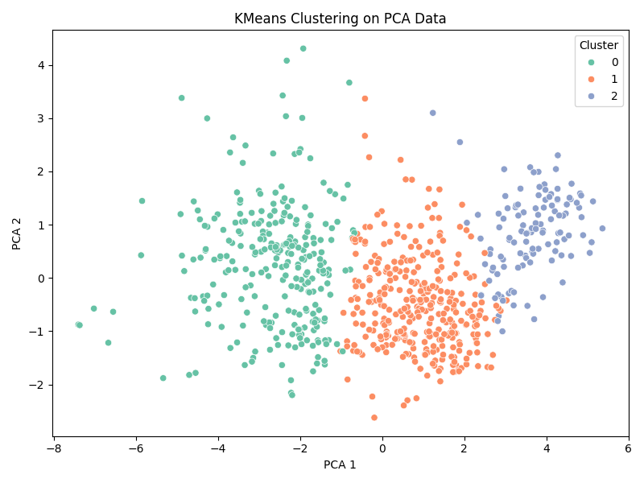

 # 🌍 World Happiness Report (2020–2024) – Data Preprocessing Project

This project demonstrates **data preprocessing** using the World Happiness Report datasets from 2020 to 2024. The preprocessing includes five essential steps:

---

## ✅ Preprocessing Steps & Techniques

| Step                   | Technique(s) Used                                |
|------------------------|--------------------------------------------------|
| 1. Data Integration    | Combined multiple CSV files (2020–2024)          |
| 2. Data Cleaning       | Standardized column names, handled missing data  |
| 3. Data Reduction      | PCA (Principal Component Analysis)               |
| 4. Data Transformation | Min-Max Normalization, Discretization            |
| 5. Data Mining         | KMeans Clustering (visualized on PCA components) |

---

## 🖼️ PCA + KMeans Clustering Plot



---

## 🛠️ How to Run

### Prerequisites:
Install dependencies using:

```bash
pip install -r requirements.txt
